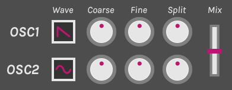

# Mika Micro manual

## Oscillators

Mika Micro has two oscillators, each with the same controls:
- **Waveform**: choose what sound the oscillator will produce.
- **Coarse**: sets the pitch of the oscillator in semitones.
- **Fine**: fine tunes the pitch.
- **Split**: when turned to the left or right, splits the oscillator into two slightly detuned oscillators, creating a thicker sound. When a new note is played, if the split control is turned to the left, the oscillators will start out of phase, creating a soft, gentle attack. If the split control is turned to the right, the oscillators will start in phase, creating a punchy, hard attack.

The **mix** control on the right sets the volume balance between the two oscillators. If the control is set all the way to oscillator 1 or 2, the other oscillator will be disabled, saving CPU cycles.

## FM

You can use the FM section to modulate the frequency of either oscillator by the output of the FM oscillator, which outputs a sine wave at oscillator 1's frequency. If you don't know what that means, that's OK! Just play with the knobs and see what happens.
- **Coarse**: sets the amount of frequency modulation to apply. Turn the knob to the left to modulate oscillator 1, or turn it to the right to modulate oscillator 2.
- **Fine**: fine tunes the amount of frequency modulation.

## Filter

When enabled, the filter removes high frequencies from the sound, resulting in a darker, duller sound.
- **Cutoff**: sets the cutoff frequency. The farther to the left the knob is turned, the darker the sound. When this knob is turned all the way to the right, the filter will be bypassed completely, saving CPU cycles.
- **Resonance 1**: creates a ringing sound around the cutoff frequency.
- **Resonance 2**: a different style of resonance. This one's a little more unpredictable, but it generally accentuates the highs in a relatively wide range around the cutoff frequency.
- **Key tracking**: adjusts the cutoff proportionally (right) or inversely (left) with the pitch of the voice. When turned all the way to the right, the filter will affect the timbre of every note equally.